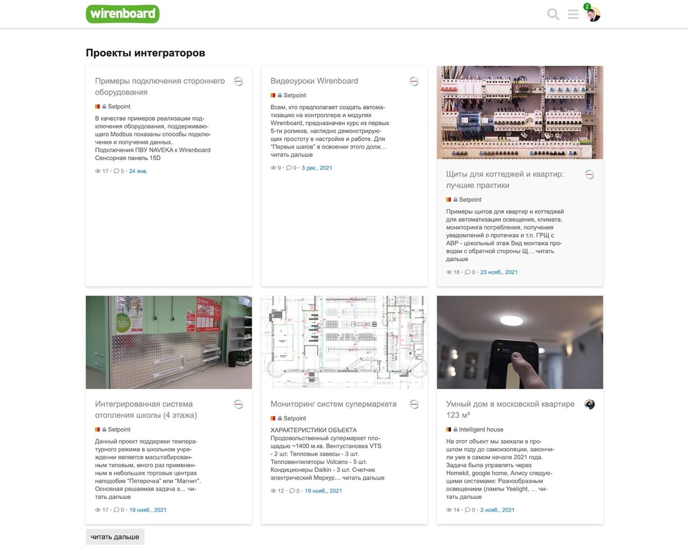
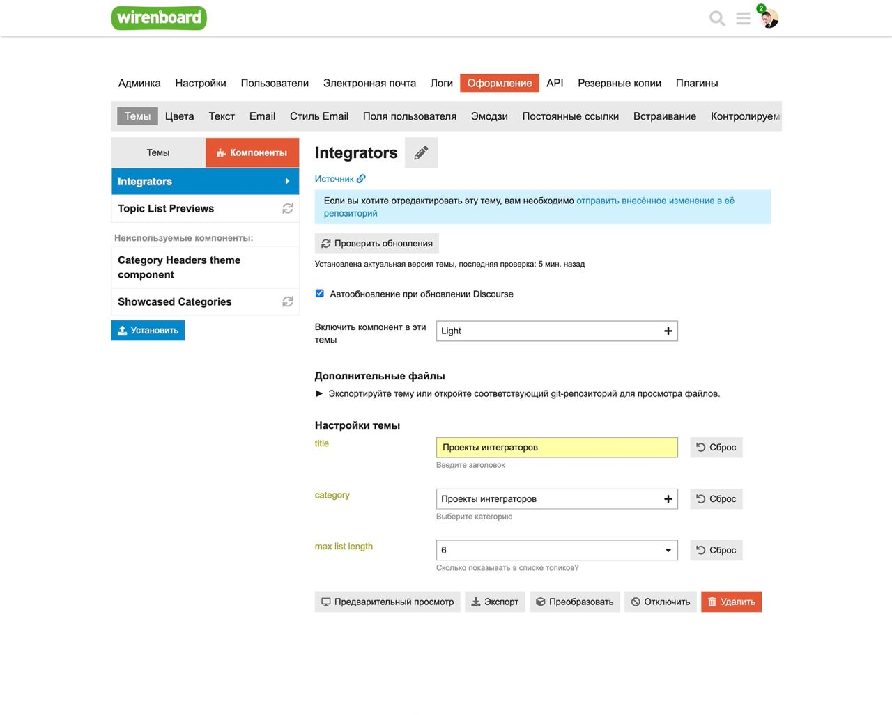

## Integrators Theme Component

Компонент для отображения постов категорий на главной

### Отображение на главной

### Настройки компонента

#### Поля

1. **title** - Заголовок отображающийся над карточками
2. **category** - Категория из которой будут выводиться посты
3. **max list length** - Количество отображаемых постов, 3, 6 или 9. По умолчанию 6